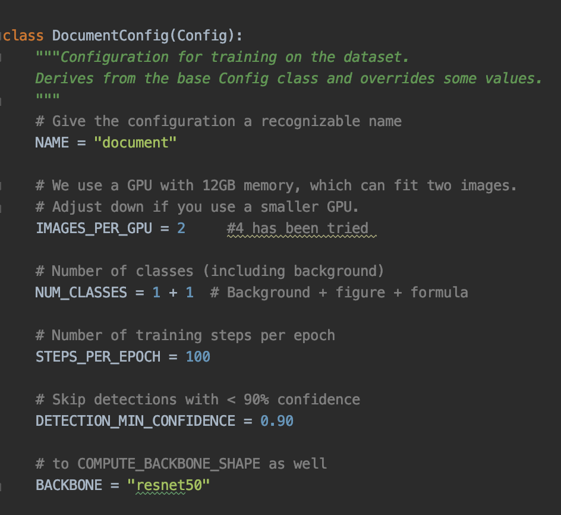
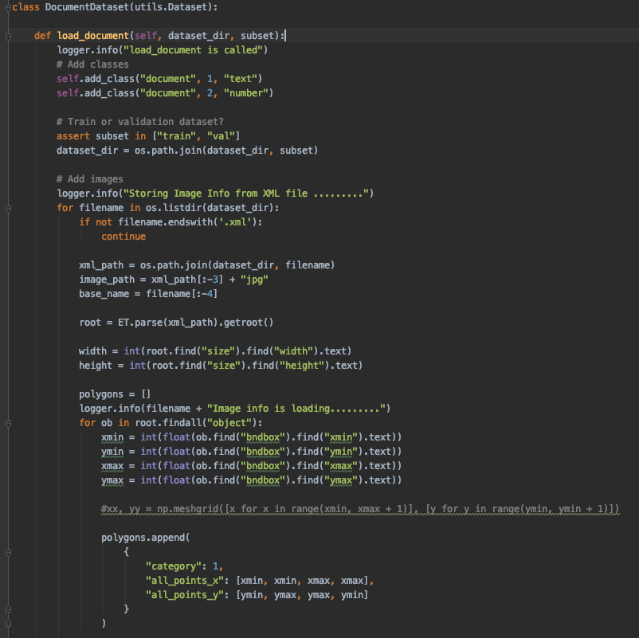

* To train the model on our own dataset we need to extend two classes and call the methods from the new subclass instances:

    * Config This class contains the default configuration. By subclassing it and modifying the
    attributes we can adopt the model with our purpose .

    * Dataset This class provides a consistent way to work with any dataset. It allows us to
    use new datasets for training without having to change the code of the model.

* I write these extended classes in the dataset file of the task directory under the root
folder. The changes I made in the sub classes are given below.



* We can change any attributes of the Config class like this. At the same way we can
override the attributes and member classes of the Dataset class as like below. In this subclass I add new methods

    * load_document this method takes image annotations from xml file.
    * Image_reference This method returns the image path listed in the annotation file.
    * Load_mask G enerate instance masks for an image. Returns masks a bool array of
    shape [height, width, instance count] with one mask per instance .




## To train the model, we need to write a command in the command line interface.
* Train a new model starting from pre-trained COCO weights
```bash 
python3 task.py train --dataset=/home/jupyter/refined/dataset
--weights=coco 
```
* Resume training a model that we had trained earlier
```bash 
python3 task.py train --dataset=/home/jupyter/POD/dataset
--weights=last 
```


Cited from: https://github.com/matterport/Mask_RCNN

